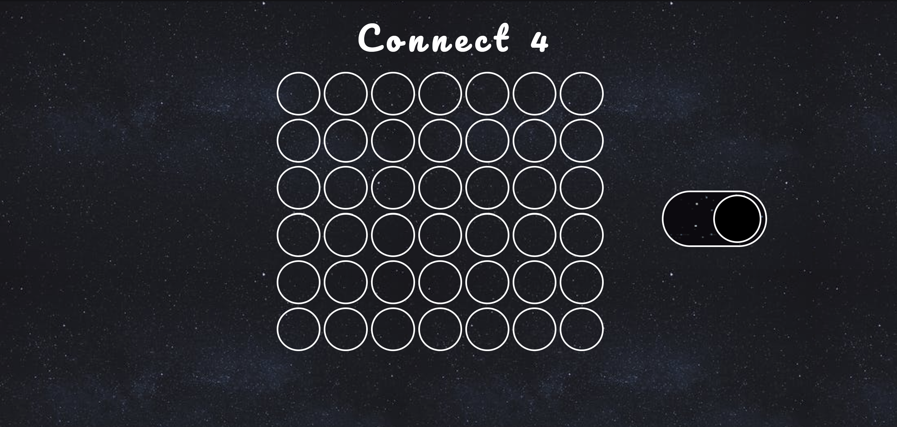
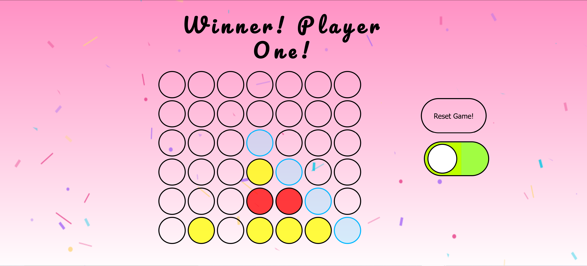

# Connect 4

## Rules

Connect 4 is a competitive 2 player game.

The primary goal in Connect 4 is to horizontally, vertically, or diagonally match up 4 of your game chips while simultaneously preventing your opponent from doing the same. Each player is only allowed to place one token per turn.

I ultimately decided to take on Connect 4 for my Unit 1 Project because it was a childhood favorite. . . .Of course the similarity to Tic-Tac-Toe didnt hurt either.

## Game Link

[Click Here To Play!](https://tender-hermann-ba7286.netlify.app/)

## ScreenShots

 - ### Dark Mode
 

- ### Winner Game Screen In Light Mode

## Technologies Used Include:

1.  HTML

2.  CSS

3.  JavaScript

4.  GitHub

4.  Google Fonts

5.  Netlify

6.  Simple CSS Animations ( animate.css )

## Next Steps

#1. Add a Pop-Up screen upon the page loading, greeting the users & collecting both users names. This is in an effort to personalize the win messages later on in the game.

#2. Incorporate a score keeping mechanism to keep track of the users win tally across multiple games.